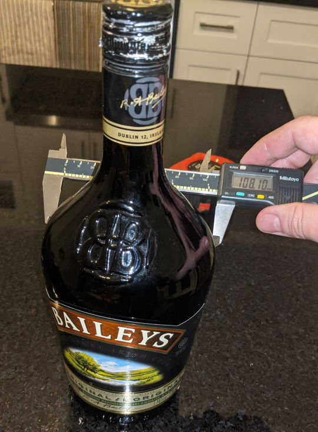

# Bottle measures

To help to design there are some existing alcohol bottle dimensions.
(I realize it's weird having mixed up units, but I live in Canada and that's how things are done.)

| Name | Base Size (mm) | Height (mm) |
|---|---|---|
| Bayleys original | 94 (small), 108 (large) | 280 |
| Mont Bonnet | 84 | 264 |
| Carioca | 97 | 305 |
| Appleton Eastate | 78 x 113 | 282 |
| Smirnoff Vokda | 77 | 305 |
| Peach Schnapps | 90 | 264 |
| Apricot Brandy | 64 (small), 107 (large) | 292 |

# Proof

These are the proof I didn't invent everything.

## Bayleys

## Mont-Bonnet

## Carioca

## Appleton State

## Smirnoff

## Peach Schnapps

## Apricot Brandy

